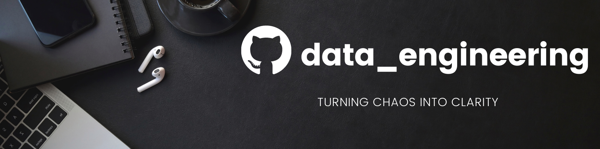

Hello 👋🏼,  
I'm Shreyas😎.

<li> 😇 Currently working on Machine Learning and Data Science Projects.
<li> 😊 Learning end to end Data Science life cycle.
<li>👨🏼‍🤝‍👨🏼 Looking to collaborate on projects based on Python, Flask and Data Science.
<li>👨🏼‍💻 HackerRank profile :- <a href="https://www.hackerrank.com/s_parab16">s_parab16</a>
<li>💬 Ask me about Astrophysics :)
<li>😁 Pronouns : He/Him
<li>✨ Fun fact : Being a cosmophile, I do watch moon, stars and planets while coding😋
<li>😍 Favorite Theme: <del>Light</del> <b>Dark</b>

## 📊 My GitHub Stats

